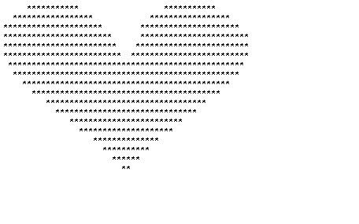

# BagelCon BattleBots 2020

This year's BattleBots competition is a modified version of Rock/Paper/Scissors.

Each bot will be provided with the entire history of the game as a command line parameter, and will be expected to
both return a json-formatted dictionary on stdout and exit with code 0.

All bots must be submitted as self contained docker images.


# Modified Rock Paper Scissors Rules

Each player must play one of "ROCK", "PAPER", or "SCISSORS".

After each player submits their hand, the rules are decided as follows, moving to the next stage if the players tie
1. Basic rock paper scissors rules. 
    - Rock beats Scissors
    - Scissors beats Paper 
    - Paper beats Rock
2. Whoever has played that hand more often in this game wins
3. Whoever has played the hand that would beat this hand more often in this game wins
4. Random Choice


Each game will be played over the course of 50 rounds.


## Example
Round 1:
    P1: ROCK
    P2: PAPER
P2 Wins naturally

Round 2:
    P1: ROCK
    P2: ROCK
No natural winner
P1 has played ROCK more often, P1 wins

Round 3:
    P1: PAPER
    P2: ROCK
P1 Wins naturally

Round 4:
    P1: ROCK
    P2: ROCK
No natural winner
both players have played ROCK the same number of times
both players have played PAPER the same number of times
Winner is `random.choice([1, 2])`
    

# Calling Conventions

## Input

Bots will be called with the entire game's history as the only command line parameter. The history is formatted as a
string of 3-tuples separated by `;` characters.

Each of the 3-tuples is of the format `(player-one-hand,player-two-hand,winner)`

### History Example

If the provided history looks like `rp2;sp1` then

- We know there have been two rounds so far in the game, and we're on round 3
- In the first round, player one played "rock", player 2 played "paper", and player 2 won
- In the second round, player one played "scissors", player 2 played "paper", and player 1 won


**Note:**
   This history string abbreviates "rock" to "r", "paper" to "p", and "scissors" to "s". This same transformation 
   **is not valid** for the output of your program - you must output the full words, in all caps.


## Output

### Basic Output

Each bot is expected to output, on a single line, a json formatted dictionary of the form
```json
{"move": "MOVE"}
```
The value for `move` must be one of `ROCK`, `PAPER`, or `SCISSORS`.

Your bot must also exit with code 0. If a different exit code is provided, your bot will automatically forfeit the round.

### Art Output

In addition the regular rock/paper/scissors competition, we're going to have an art competition!
Each bot may include an `"art"` key in their json output. The value for this key is a 2-dimensional matrix with up to
60 rows and 60 columns.

These images will be displayed in some way during 

```json
{"art": [], "move": "MOVE"}
```
The value for the `art` key can be an array of up to 60 strings, and each of those strings can have a max of 60 characters.
In effect, this gives a 60x60 grid to produce ascii art alongside your gameplay.

For example, to embed the ascii image
```
     ***********                  ***********
  *****************            *****************
*********************        *********************
***********************      ***********************
************************    ************************
*************************  *************************
 **************************************************
  ************************************************
    ********************************************
      ****************************************
         **********************************
           ******************************
              ************************
                ********************
                   **************
                     **********
                       ******
                         **
```

you would output

```json
{"move": "ROCK", "art": ["     ***********                  ***********         ","  *****************            *****************      ","*********************        *********************    ","***********************      ***********************  ","************************    ************************  ","*************************  *************************  "," **************************************************   ","  ************************************************    ","    ********************************************      ","      ****************************************        ","         **********************************           ","           ******************************             ","              ************************                ","                ********************                  ","                   **************                     ","                     **********                       ","                       ******                         ","                         **                           "]}
```

The images collected from the 50 rounds of play will be strung together to form a gif, with each image being one frame in the gif. 

As an example, the images in `sample-art` were strung together to create



# Getting Started

There are example bots with modification instructions in the `examples/` directory. Each of these examples is
configured to produce a docker image that follows all of the rules and conventions described in this document.

So long as you also follow the rules and conventions described in this document, you're free to submit any docker
image you like - there's no need to start with any of the provided examples.

## Submitting Your Bot

All bots must be submitted as runnable docker images. For a submitted image `IMAGE`, it will be run as
```bash
docker run \
    --network=none \
    ${IMAGE} "${HISTORY}"
```
**Note:** `HISTORY` will be an empty string for the first round, and your bot must be able to handle that.

**Note:** containers will be given 5 seconds to run, after which they will be forfeit and be terminated

**Note:** `network=none` means that your code will not be able to access any form of network or internet at runtime.
This is to prevent people from using external resources to track other bot performance.

Docker images must be published to either Docker Hub or Github Packages. See me for more help if you need it.

We're using external docker repositories over any internal image repositories for security, cost, and ease-of-use reasons.

## Testing ASCII Art

To speed up ASCII Art testing, there's a utility built in to the battlebot runner to generate GIFs from ascii art files

Create a folder and fill it with files representing the frames of your gif. These files must end in `.ascii` and will
be loaded in alphabetical order to create frames.

You can then create a gif as such:

```bash
IMAGE_PATH=/path/to/ascii/folder
docker run \
    -v ${IMAGE_PATH}:/images  \
    docker.pkg.github.com/tylerlubeck/battlebots/battlebots:latest \
        generate-gif /images /images/output.gif
```

# The Tournament

The Tournament will consist of two competitions

1. A rock/paper/scissors competition, run tournament bracket style
2. An art competition, where conference attendees will vote on the best art piece created by your bot

On tournament day, image names will be collected from participants. We'll then download the images and use the downloaded
versions for the tournament - this means no updating images during the tournament!
